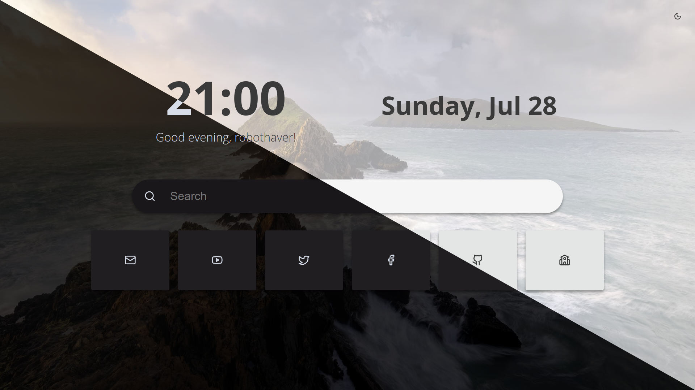

# BentoLight
A simplifyed rewrite of the [Bento start page](https://github.com/migueravila/Bento)



# Features

- Load random background image on startup
- Searchbar
- Dark/light mode
- Customizable buttons
- Customizable clock and greet messages
- 4 color modes

Please host on a server to ensure the icons and images load correctly from the configuration.

# Customization

## All customizations can be done through the config.js file

```js
const config = {
  // General
  userName: "username",
  openInNewTab: false,
  imageBackground: false, // You can add images to the backgroundImages array
  twelveHourFormat: false,
  searchBar: true,
  theme: "Original", // Original, Mint, Crimson, Pinky

  // Greetings
  greetingMorning: "Good morning,",
  greetingAfternoon: "Good afternoon,",
  greetingEvening: "Good evening,",
  greetingNight: "Go to Sleep!",
};

const buttons = [
  // Create buttons here like:
  // new Button(
  //   icon location,
  //   link
  // ),
];

const backgroundImages = [
  // Put paths to background images here.
  // If you want to use the background loader, 
  // just place your images in to the assets/background_images directory 
  // and leave the path empty in the app.
];

```
